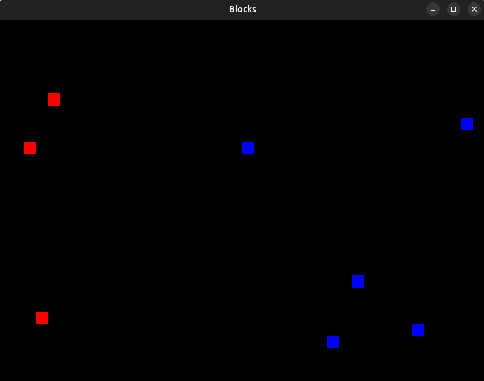
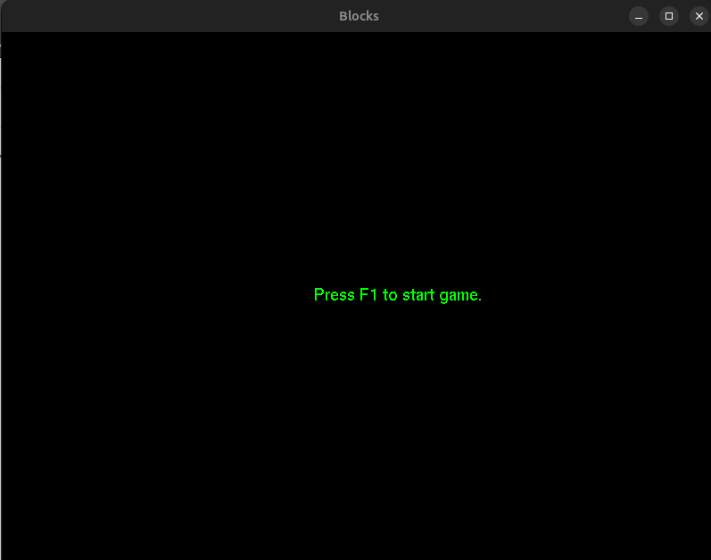

# Blocks ;;

My first OpenGL C++ game/game-engine

## Overview

Blocks is a simple game engine built using OpenGL and C++. The engine is designed to render blocks on the screen, with different colors representing different types of blocks (e.g., enemies and friends).

###### Objectives
* The game engine will soley focus on block based games
* It will provide a framwork for basic game control and flow control
* The engine will provide a selection of "spawner" that can be used in games
* Additionally, games can create their own spawners;
* Over time I will decide more features, I know its a bit rough around the edges but a game engine is a good way to learn game dev so thats what ill do!

## Screenshot

## How It Works

The game engine uses OpenGL to render blocks on the screen. 
Each block can be either a friend or enemy with a score/value.

The game itself can control how many blocks to be rendered at one time. The engine will spawn a random Block by pressing "s" on the keyboard.
